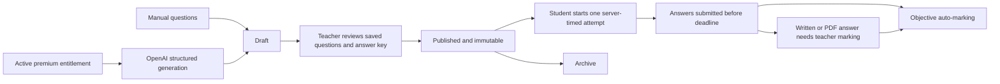

# Owner pricing, real-session entry and Papers

This revision supersedes older public pricing and demo instructions in the
project. It removes automatic fictional-account startup and the public plan
cards from the normal interface. Historical test fixtures remain in source for
regression testing; they are not provisioned into the database. Only the three
known fictional workspace browser stores are cleared on startup. Personal
notes, uploaded files and server financial records are retained.

## Authentication and deployment

The root resolves `/api/method/institute_lms.portal_session.current` before
loading a workspace. Role tiles never grant permissions. The configured and
provisioned owner uses a separate component and owner-only APIs. Active institute
membership determines Teacher/Student/Institute Admin access. Accounts without
membership receive profile/mobile onboarding. Frappe handles password login,
reset, configured Google OAuth and MFA; the registration email-code flow creates
an approval request, not an immediately privileged account.

Set `il_owner_email` to the requested owner address and only set
`il_owner_provisioned` after creating and securing that Frappe account. Do not
embed passwords, API secrets or verification codes in frontend configuration.
No production authentication service was provisioned by this revision.

For local development, set `SISU_FRAPPE_URL` to your **own** running Frappe site,
then restart the Vite development server. `/api`, `/login`, `/me`, private/public
files and Frappe assets are proxied through the same local origin. In production,
serve `/campus` on the Frappe site directly. Do not deploy Vite as the server.

Run `bench --site SITE migrate` to install new DocTypes/indexes. Install the
updated app dependencies (Pillow is used to decode, strip metadata, crop and
compress profile images). A database backup and staging run are required before
upgrading a live site. The project's upstream develop snapshot requires Python
3.14, although the custom app's pure rule tests also run on Python 3.12.

## Pricing mathematics

All supported currencies have two decimal minor units. Current allowlist:
USD, LKR, EUR, GBP, AED, SAR. No inferred exchange rates or currency mixing.

```
extra units = max(0, active students − included units)
subtotal = base amount + extra units × unit amount
discount = round_half_up(subtotal × discount basis points / 10,000)
net = subtotal − discount
tax = round_half_up(net × tax basis points / 10,000)
total = net + tax
```

Example: base 10,000 minor units, 500 included, 50 per extra unit, 503 active
students yields 10,150 before discount/tax. The owner chooses every parameter;
these numbers are test examples, not advertised tariffs. Non-institute products
use one unit. Institute usage counts distinct active Student memberships on that
site. Multi-site usage aggregation is not implemented.

Assignments serialize on the customer User row. New revisions deactivate prior
assignments and preserve them for audit. A checkout quote stores its assignment,
currency, interval, server-measured usage, breakdown and 15-minute expiry. The
browser cannot send the final amount. Missing assignment fails closed; zero cost
requires an explicit zero assignment. Quotes do **not** collect payment or unlock
products. Subscription settlement integration remains outstanding.

Classroom fees are separately owner-controlled. Existing classroom checkout is
LKR: institute beneficiaries receive the classroom amount; the student's assigned
`Class payment` contract adds the recurring platform amount per installment.
That assignment must be LKR / Per payment. School mode bypasses student class
checkout. The platform no longer automatically applies US$1 or LKR50/seat tariffs.
Existing invoices and receipts are not rewritten. The old automatic institute
bill generator is retired until assigned recurring settlement is implemented.

## New database entities

| Entity | Purpose |
|---|---|
| IL Price Assignment | Customer/type, institute, product, currency, interval, fixed/usage amounts, discount/tax, active revision, reason and actor |
| IL Checkout Quote | Frozen customer quote, assignment, total, JSON breakdown, expiry and status |
| IL Product Entitlement | Customer/product, expiry, revocation, reason and granting owner |
| IL Paper | Class/institute, manual/AI source, questions/answer key, dates, duration, marks, draft/published/archived, document and publication actor |
| IL Paper Attempt | Unique paper/student key, server deadline, answers/PDF, state, score and feedback |
| IL Attendance | Unique session/student key, physical/online, status, recording actor/time and note |
| IL Support Ticket / Reply | Private site-scoped support conversation and workflow state |

All new DocTypes have empty generic REST role permissions. Mutations require
the service flag and explicit API checks. Standard teacher/student accounts
cannot directly read an answer key or mutate a price with `/api/resource`.
Existing wallet entities and payout transitions are described in
`WALLETS_AND_PAYOUTS.md`.

## API catalogue

All paths start `/api/method/institute_lms.`. Read APIs support authenticated GET
or the portal's POST client unless restricted below. Mutations are POST only.

| Module | Methods | Access |
|---|---|---|
| portal_session | current (GET), overview | Guest session lookup; owner metrics |
| owner_pricing | assign, assignments, classroom_price | Owner only |
| owner_pricing | quote, entitlements | Authenticated customer, own account |
| owner_pricing | grant, revoke | Owner only, reason required |
| profiles | upload_image | Own saved Teacher/Institute profile only |
| papers | listing, detail, start, submit, submissions | Current class access; own student attempts |
| papers | draft, publish, archive, mark | Institute administrator or owning teacher |
| papers | generate | Classroom manager + active AI Papers entitlement |
| papers | upload_answer, answer_file (GET) | Own active attempt upload; own student or class-manager read |
| operations | mark_attendance, attendance_csv (GET) | Classroom manager |
| operations | join_session, attendance | Active class member; students see own rows |
| operations | create_ticket, tickets, thread, reply | Requester or institute administrator; only admin sets status |

## Paper lifecycle



The AI adapter uses the existing encrypted OpenAI settings and the Responses
API's [structured output format](https://developers.openai.com/api/docs/guides/structured-outputs).
It validates generated questions again on the server, limits generation to
20 questions, uses no student records, disables response storage and never
automatically publishes. The teacher must review generated accuracy. A key,
compatible configured model and real provider tests are still needed.

Profiles accept JPEG/PNG/WebP up to 5 MB and 20 megapixels. Avatars become
400×400; covers 1600×600 (8:3). Re-encoding removes uploaded metadata. These
are intentionally public images; private paper answers remain private Files.

## Known limits before release

- No real Frappe session/database migration has been exercised in this local
  Vite-only environment. Rule tests and Frappe boundary doubles are not a substitute.
- Google OAuth, SMS, SMTP, payments.lk settlement, subscription activation and
  OpenAI need configuration and acceptance tests. No successful real charge or
  live AI generation is claimed.
- A timed paper rejects late submissions. It does not yet autosave each answer
  or submit on behalf of a disconnected student after expiry.
- The attendance CSV exports one bounded page; online join API must be connected
  to the live player and does not certify viewing duration.
- One institute per Frappe site is retained. Cross-site discovery/join/billing
  requires a separate trusted directory bridge.
- See `REFERENCE_FEATURE_MAP.md` for reference modules not yet implemented.

## Validation recorded for this revision

- 97 Python rule and service-boundary tests passed. These use doubles for Frappe; no database integration pass is claimed.
- 43 JavaScript regression tests passed, including historical fixtures isolated from the normal transport.
- Vite production asset build passed; Python modules compiled successfully.
- Browser checks verified role-tile selection, light/dark appearance, student/institute signup variation, absence of public plan prices, and a 390 px mobile layout without horizontal overflow.
- Protected dashboards were not browser-tested with real accounts because a Frappe site is not connected. A Docker Hub manifest request timed out; no new containers or real accounts were created.
