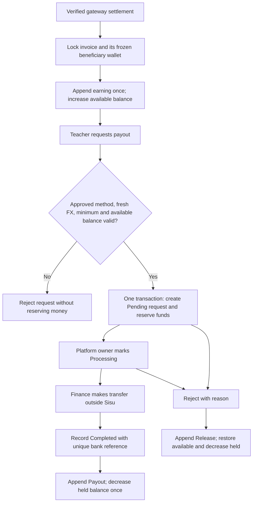

# Teacher wallets and payout processing

Implemented source and local preview, 25 September 2026. No money is held or transferred by the preview. This document supersedes earlier pricing/status text where the latest user instructions differ.

## Confirmed commercial rules

- Student platform fee: **US$1 with every recurring class payment**, separately disclosed from the class fee. A teacher-free class still carries this fee.
- Independent class earnings belong to the teacher. Institute-owned class earnings belong to that institute. A teacher's memberships never cause the same payment to credit both wallets.
- School workspaces do not collect student class fees in the LMS; school platform subscription billing remains separate.
- International payout minimum: **US$20**. Local minimum: **the LKR equivalent of US$20** using a platform-managed, dated USD/LKR reference rate. No silent or live FX lookup.
- Local LKR and international USD balances remain separate. The preview's LKR 6,000 minimum uses a fictional 300 LKR/USD rate; it is not a current exchange-rate quote.
- To-do and Journal are separate US$1/month apps. Study Space is a separate premium app whose final subscription price remains unconfigured. One card-qualified three-day trial covers available premium functionality, excluding tuition and future/unreleased features.

## Database schema

All financial values below are integer minor units (100 = one LKR or one USD). Amount input is parsed with Decimal; more than two decimal places, non-finite values and negative requests are rejected.

| Frappe DocType | Main fields | Constraints and purpose |
|---|---|---|
| IL Wallet | owner_user → User; beneficiary Teacher/Institute; institute → IL Institute; country; currency; available_minor; held_minor; enabled | Unique identity_key across owner, beneficiary, institute and currency. Cached balances updated with the ledger under a wallet row lock. |
| IL Wallet Transaction | wallet → Wallet; kind Earning/Reserve/Release/Payout/Reversal; available_delta; held_delta; available_after; held_after; invoice; payout; actor; reference | Unique event_key. Append-only ledger: no updates or deletions through document APIs. Frappe creation timestamp records entry time. |
| IL Payout Method | wallet → Wallet; kind Local Bank/Wise/Payoneer/SWIFT / IBAN; country; masked_label; secret_details; status; submitted_by; reviewed_by; reviewed_at; review_reason | Sensitive details use a Frappe Password field and encrypted secret store. Updates create a new method revision. Previous approval becomes Superseded, preserving destinations already referenced by payouts. |
| IL Payout Request | wallet → Wallet; method → Payout Method; amount_minor; currency; region Local/International; status; transaction_reference; receipt → private File; processed_by; completed_at; reason | Unique request_key prevents duplicate reservations. Unique settlement_key prevents reusing a completed transfer reference. Original method revision is frozen. |
| IL Payout Audit | action; actor; reference; details | Append-only review/export/reveal/status audit. Never stores unmasked account details or passwords in audit text. |
| IL Invoice (extended) | payout_wallet; currency; beneficiary_minor; platform_minor | Recipient and amount split frozen before checkout. Existing invoices without a split are not retroactively credited or surcharged. |

The five financial DocTypes have no generic REST/Desk CRUD permissions. Their controllers require service flags; the service checks the signed-in owner or the configured platform owner before bypassing document permissions. Server source and database administrators remain trusted operators.

Local destination fields: Bank name, Branch, Account holder name, Account number. International: Wise email, Payoneer ID, or Bank/Holder/SWIFT/IBAN. IBAN checksum and BIC format are validated. Valid formatting does not verify real account ownership; finance must check that separately before approval.

The secret field permits 2,048 characters, accommodating the bounded Unicode JSON payload and Frappe's same-length masking value. This follows the framework's [password persistence and field-length validation implementation](https://github.com/frappe/frappe/blob/develop/frappe/model/base_document.py).

## API endpoints

Frappe method URLs use `/api/method/institute_lms.wallet.<method>`. Successful JSON calls return Frappe's `message` envelope. POST calls require an authenticated session and CSRF token. No public wallet mutations or client-authoritative balance updates exist.

| HTTP | Method | Authorized caller | Main arguments / response |
|---|---|---|---|
| POST | provision_wallet | Sole platform owner | user, beneficiary, country, currency, institute optional → wallet name; starting balance zero |
| GET | dashboard | Wallet beneficiary; owner may inspect a named wallet | wallet optional, page → masked methods, balance, minimum, 25 ledger records and recent requests |
| POST | submit_method | Beneficiary | wallet, data → Pending method revision |
| POST | review_method | Platform owner | method, decision Approved/Rejected, reason → status |
| POST | request_payout | Beneficiary | wallet, method, decimal amount, request_key → Pending request; exact retries return original |
| POST | update_payout | Platform owner | request, status, reference, reason, optional private receipt File ID → status |
| GET | admin_queue | Platform owner | region Local/International, page → 50 pending/processing requests and pending method revisions |
| POST | reveal_method | Platform owner | method → decrypted destination; audited |
| POST | export_local | Platform owner | requests: 1–200 unique Processing local payout names → UTF-8 BOM CSV download; audited |

Only the configured `il_owner_email` after owner provisioning can approve and settle. Assigning a generic System Manager role does not grant these service operations. Self-approval and self-settlement are denied. The current sole-owner model therefore intentionally cannot settle the owner's own beneficiary wallet.

Example beneficiary request (no real credentials):

```json
{
  "wallet": "wallet-document-name",
  "method": "approved-method-document-name",
  "amount": "20.00",
  "request_key": "45eea11a-c01a-40f6-a9bb-4ae9044f00ac"
}
```

Reuse the same request key after a network timeout. Reusing it with a different amount or destination is rejected. The Vue client keeps a key for the same in-progress request intent until success.

## State and ledger flow



| Event | Available | Held |
|---|---:|---:|
| Earn 100 | +100 | 0 |
| Reserve 20 | −20 | +20 |
| Complete reserved 20 | 0 | −20 |
| Reject reserved 20 | +20 | −20 |
| Reverse earning 10 | −10 | 0 |

Pending can become Processing or Rejected. Processing can become Completed or Rejected. Completed and Rejected are terminal. Completing Pending directly is rejected. Rejected requests release exactly their reserved amount; changing a terminal request's details is rejected. An exact completed-response retry makes no new ledger entry.

Request validation, row lock, insertion, ledger entry and balance update run in one Frappe POST transaction. There is no intermediate commit. Concurrent requests for the same wallet serialize on `SELECT … FOR UPDATE`; database unique keys protect retries. Live MariaDB concurrency and rollback tests remain required on staging.

`record_earning` is an internal helper invoked only after validated gateway success. It reconciles invoice amount = beneficiary + platform amounts. `reverse_earning` is an internal verified-refund adapter entry point and caps cumulative reversals at the original earning. The refund provider webhook is not wired yet. A reversal may make available balance negative; new payouts and completion are then blocked until finance reconciles it. This is an earnings subledger, not a complete accounting/general-ledger system.

## Rate and rollout configuration

Set `il_usd_lkr_rate` and `il_usd_lkr_rate_updated_at` on the Frappe site using finance's approved reference source. The timestamp uses the site's configured time. The rate must be positive, finite, and no more than seven days old or in the future. The LKR minimum is rounded upward to the nearest minor unit. Stale or missing rates block local payout requests; there is no fallback to the demo rate.

`il_class_platform_fee_enabled` is an explicit rollout flag, off unless configured. When enabled, the native institute enrollment API freezes the institute's LKR wallet, teacher amount and converted US$1 fee on every new installment invoice. For teacher-free institute classes it creates a platform-fee-only invoice. School-mode enrollment produces no student invoice. Existing contracts are not silently changed. Future recurring invoices must use the same quote service; a recurring invoice generation scheduler has not been added in this change.

The existing payments.lk adapter collects LKR. International USD recurring checkout and independent native-course invoice routing still require the relevant provider/course adapters. The wallet API supports those beneficiaries; creating a wallet does not itself connect their course checkout. Do not enable a currency by merely changing a display label.

## Bank export and receipts

CSV is a **review/export format**, not a certified CEFTS/SLIPS bulk-upload specification. It includes reference, bank, branch, holder, account number as text, amount and currency. Formula-leading cells are neutralized and leading account zeros are retained. Finance must map it to the chosen bank's actual import template and confirm transfers outside Sisu. Export never initiates payment. Excel can open the CSV; native XLSX export is not included.

The distinction matters because [LankaPay SLIPS](https://www.lankapay.net/en/for-financial/lankapay-slips) and [CBSL's CEFTS implementation note](https://www.cbsl.gov.lk/sites/default/files/cbslweb_documents/statistics/otherpub/information_series_note_20250224_fast_payments_for_everyone_cefts_implementation_in_srilanka_e.pdf) describe payment infrastructure, not a universal commercial-bank upload template.

A completion may reference an existing private Frappe File attached to the exact payout request. The service rejects public files and attachments belonging to another request. A dedicated receipt-upload control remains to be connected to the standard private upload endpoint.

## Profile, verification and app services

Additional DocTypes: IL Public Profile (unique user and username, status/code); IL Verified Phone (unique user); IL Profile Relationship (unique user/provider/kind); IL Provider Update (30-day expiry); IL Trial Claim (unique user, card token reference and expiry).

`/api/method/institute_lms.profiles.*`: me, save_profile, pending, review, search, relate, change_relationship, relationships, publish_update, followed_updates. Reads use GET, mutations POST. Providers submit for owner review; students self-register. Follow is distinct from Student join or Teacher membership. Leaving membership preserves a separate follow preference. Paid content permissions remain with enrollment/payment APIs. The nightly job deletes expired provider updates; reads exclude them immediately at expiry.

`/api/method/institute_lms.mobile_verification.*`: POST request_code(phone), verify(code), claim_trial(). Phone codes are six digits, expire in ten minutes, allow five attempts, and are stored only as HMAC digests. Requests are rate-limited by user, phone and IP. HTTPS and a configured trusted `il_send_verification_sms` hook are required. This verifies phone ownership; it does not replace Frappe login MFA.

The trusted `il_verified_card_for_user` hook must query the hosted payment provider and return `{user, verified, reference}` only after verified setup for the current account. `claim_trial` creates one three-day claim using server time. Store provider tokens only, never PAN/CVC. The browser preview uses an explicitly fictional verified-card checkbox; no card is collected, charged or renewed. Native entitlement enforcement must be wired into each premium app before sale.

Google/business Google sign-in delegates to Frappe's [Social Login Key](https://docs.frappe.io/framework/user/en/guides/integration/social_login_key) configuration. The local Google button is a simulation. Native Google client credentials, SMS delivery, hosted-card setup, and end-to-end profile-to-institute membership provisioning are **not connected or validated** in this environment. Provider review alone does not prove Google Workspace domain ownership.

## Validation and release boundary

79 Python tests and 43 JavaScript tests pass; frontend production compilation succeeds. Tests cover money precision, transition rules, identity isolation, duplicate request handling, stale FX, rejection releases, profile uniqueness, follow/join separation and existing LMS behavior. Browser checks cover local destination approval, LKR-equivalent reservation, completed ledger balance, three-day app unlock and light/dark UI.

This package is a reviewable implementation and preview, **not an approved production deployment**. Remaining launch work includes Frappe-site migrations, native authenticated profile/enrollment bridging, real providers and credentials, refund/chargeback reconciliation, native premium subscriptions, bank-template mapping, independent security/accessibility review and real concurrency/rollback acceptance tests. No real transactions, account approvals or verification messages were executed during development.
